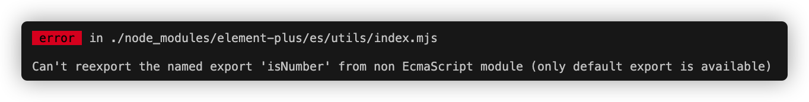
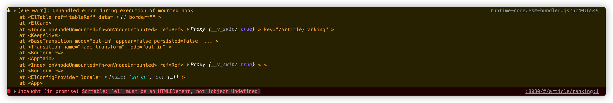
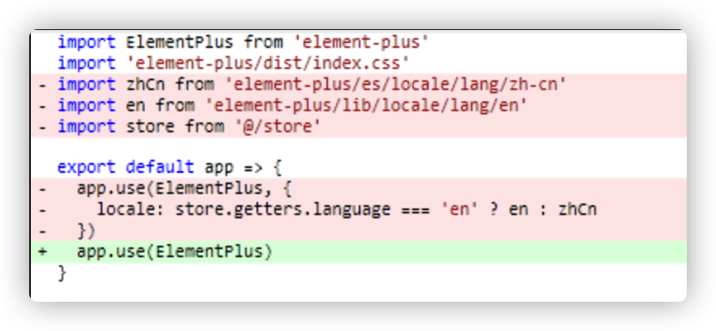
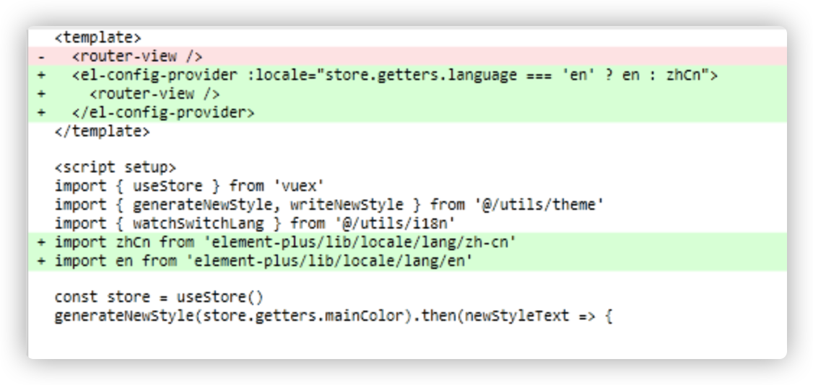
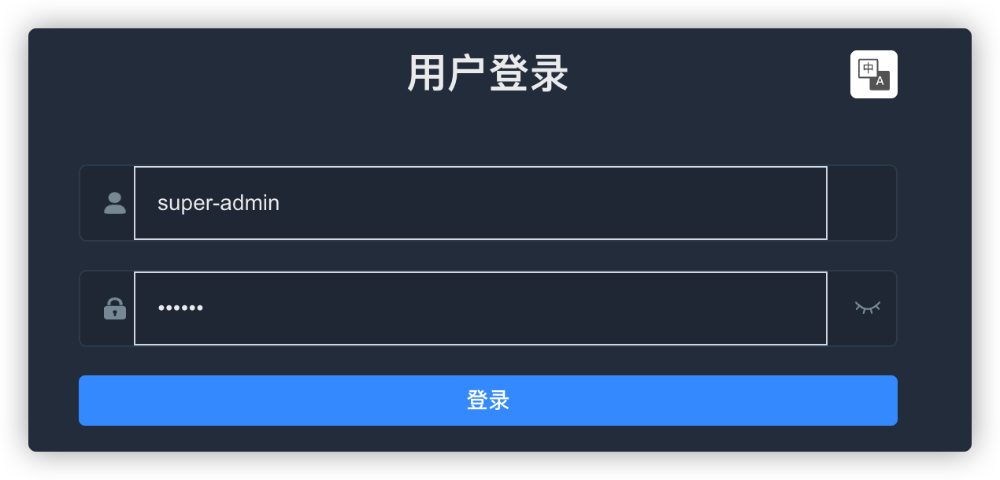
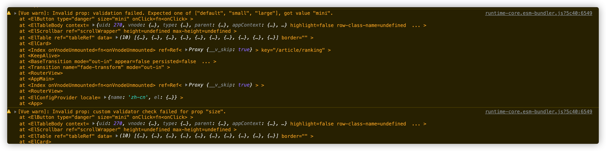
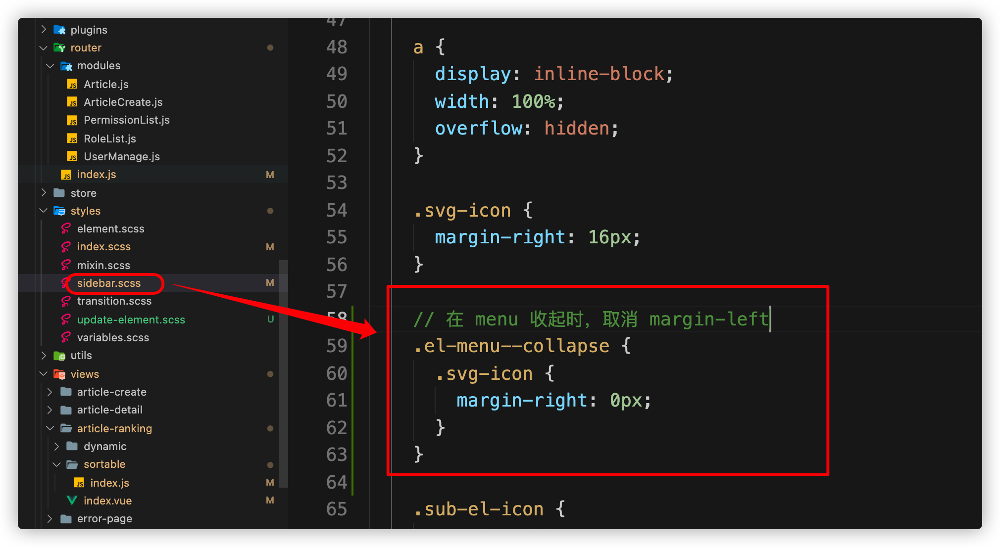
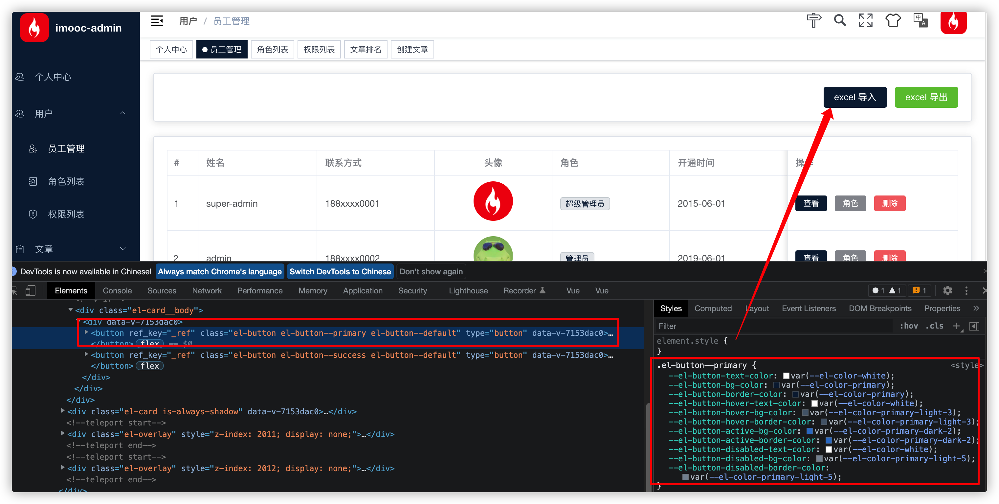

# 关于 element-plus 升级为最新版本的更新

升级前版本：`    "element-plus": "^1.1.0-beta.15",`

升级目标版本：`    "element-plus": "^2.0.4",`

## 升级说明

同学们大家好，`element-plus` 于 `2022年2月7日`正式发布了 `2.0.0` 正式版，很多同学升级了版本之后，发现出现了很多的问题，产生了很多的苦恼，所以我觉得我们是时机拥抱最新的 `element-plus` 版本变化了 😄

截止到当前 `element-plus` 的最新版本为 `2.0.4` 那么我们就以这个最新的版本来作为我们的 **升级目标版本** 进行处理 `element-plus` 的正式版问题。

## 升级内容涉及到的部分

1. 错误： `Can't reexport the named export 'xxx' from non EcmaScript module (only default export is available)` 处理

   

2. `element-plus` 的国际化问题

3. `icons` 使用问题

4. 样式错误的问题

5. 访问 文章排名 （`/article/ranking`） 出现 `Sortable: `el` must be an HTMLElement, not [object Undefined]` 的错误

   

6. `menu` 菜单图标显示的问题

7. 全局主题替换按钮颜色的替换问题

8. 替换主题之后，按钮 `active` 状态下的样式处理


## 问题一： `Can't reexport the named export 'xxx' ...`

当我们升级了 `element-plus` 的版本之后，再去运行项目则会遇到这样的一个错误，该问题是 **element-plus** 对 `webpack` 的一个编译处理问题（ [Issue链接](https://github.com/element-plus/element-plus/issues/3923)），该问题本应该由 `element-plus` 内部进行处理，但是它并没有这么做，而对于我们而言可以通过以下方式进行处理：

在 `vue.config.js` 的 `chainWebpack` 下新增一个规则：

```js
// 创建一个新的规则，用于处理 element-plus 2 的错误
    config.module
      .rule('element-plus-2')
      .test(/\.mjs$/)
      // https://webpack.docschina.org/configuration/module/#ruletype
      .type('javascript/auto')
      .include.add(/node_modules/)
      .end()
```

重新运行项目，该问题即可处理。

## 问题二：`element-plus` 的国际化问题

在最初我们项目发布时，`element-plus` 并没有提供 **兼容 `vue-i18n`** 的 **国际化处理方案**。在咱们课程发布后不久 `element-plus` 已补全了这一块的内容，针对于此，我们专门更新了对应的 [文档信息](https://git.imooc.com/coding-542/Nodes/src/master/%e7%ac%ac%e4%ba%94%e7%ab%a0%ef%bc%9a%e5%90%8e%e5%8f%b0%e9%a1%b9%e7%9b%ae%e5%89%8d%e7%ab%af%e7%bb%bc%e5%90%88%e8%a7%a3%e5%86%b3%e6%96%b9%e6%a1%88%e4%b9%8b%e9%80%9a%e7%94%a8%e5%8a%9f%e8%83%bd%e5%bc%80%e5%8f%91.md#%E6%9B%B4%E6%96%B0%E5%85%B3%E4%BA%8E-element-plus-%E5%9B%BD%E9%99%85%E5%8C%96%E9%97%AE%E9%A2%98%E6%9B%B4%E6%96%B0) ，那么这次趁这个机会我们再重新声明一下。

> 现在 `element-plus` 已经提供了 [国际化的处理方案](https://element-plus.org/zh-CN/guide/i18n.html#configprovider)，我们可以直接通过 `el-config-provider` 组件中的 `locale` 属性来指定当前国际化环境。
>
> 具体代码如下：
>
> 1. 在 `src/plugins/element` 中：
>
>    
>
> 2. 在 `src/App.vue` 中：
>
>    


## 问题三：`icons` 使用问题

对于  [icon](https://element-plus.org/zh-CN/component/icon.html#%E4%BD%BF%E7%94%A8%E5%9B%BE%E6%A0%87)  的使用，也是被大家一直吐槽的内容，所以针对这个问题，我们还专门进行了一个 [置顶的问答](https://coding.imooc.com/learn/questiondetail/380V96vy44JX4Nxw.html) 

> 对于 [element-plus](https://element-plus.org/zh-CN/component/icon.html#simple-usage) 目前主要有三个版本，这三个版本对于 icons 组件的处理各不相同，下面会罗列出各自版本的使用方式：
>
> 1. 《1.1.x》版本，这也是课程使用的版本。该版本无需专门下载 icons 依赖包。**（推荐使用！！！！）**
> 2. 《1.2.x》版本。这个版本下，element-plus 抽离了 icons 组件，形成了一个单独的依赖包 element-plus/icons 。如果要使用，则需要单独执行 `npm install --save @element-plus/icons`
> 3. 《1.3.x》版本。这个版本下，element-plus 又对 cions 组件进行了修改，不在以 element-plus/icons 命名，更改为 element-plus/icons-vue 。如果要使用，则需要单独执行 `npm install --save @element-plus/icons-vue`

下面是一个简单的使用

```vue
<template>
  <div style="font-size: 20px;">
    <edit style="width: 1em; height: 1em; margin-right: 8px;" />
  </div>
</template>

<script setup>
import { Edit } from '@element-plus/icons-vue'
<script>
```

渲染结果：


## 问题四：样式错误的问题

当我们处理好以上问题之后，再来看我们的 `UI` ，可能会发现我们的页面变成了以下这个样子：



很多的地方都出现了 **“破版”** 的问题

那么针对于这些问题，我们则需要通过 `css` 进行统一处理。

为了明确该 `css` 的作用，以及方便日后的维护，我们可以需要创建一个新得 `css` 文件 `update-element.scss` ，并把它放入到 `styles` 之中：

1. 创建 `src/styles/update-element.scss`

   ```scss
   // 处理 input 的白/蓝边
   .el-input__inner {
     box-shadow: none !important;
     --el-select-input-focus-border-color: none !important;
   }
   
   // 处理图片的灰色底
   .el-avatar {
     --el-avatar-bg-color: none !important;
   }
   
   ```

   

2. 在 `src/styles/index.scss` 导入

   ```scss
   @import './update-element.scss';
   ```


## 问题五：访问《文章排名》报错


这里其实有两个问题，一个是错误，一个是警告。

### 解决错误

这个错误的指的是没有办法找到 `el` 。

而出现的原因是因为在 `src/views/article-ranking/sortable/index.js` 中我们通过 `    '.el-table__body-wrapper > table > tbody'` 来获取 `el元素` 。但是在 `element-plus 的 2.0.0 ` 版本中，`tbody` 的路径发生了变化，所以会导致原代码无法获取到 `el`

那么解决的方案也很简单，我们只需要修改 `el 路径` 即可：

```js
const el = tableRef.value.$el.querySelectorAll('.el-table__body > tbody')[0]
```


### 解决警告

解决完这个错误之后，它上面的警告也随之消失，但是同时还有一些其他的警告存在：



而对于这个警告其实就非常的简单了。

这个警告是因为在 最新版本中，`el-button` 的 `size ` 可选项发生了变化，目前仅可以完成 **三选一 `["default", "small", "large"]`** ，而我们使用的 `mini` 已经不存在了。

所以我们只需要把 `size="mini"` 改成 `size="small"` 即可


## 问题六：`menu` 菜单图标显示的问题

升级之后的图标显示存在一些错误：

展开时，个人中心图标消失：


收起时，图标消失：


### 展开时的图标问题：

展开时 **个人中心** 图标之所以消失，是因为 **问题三** 的 `icons` 处理问题。

打开 `src/layout/components/Sidebar/MenuItem.vue`：

当前的代码为：

```html
<template>
  <i v-if="icon.includes('el-icon')" class="sub-el-icon" :class="icon"></i>
  <svg-icon v-else :icon="icon"></svg-icon>
  <span>{{ generateTitle(title) }}</span>
</template>
```

因为 `i` 标签不再被渲染，所以导致 **个人中心的图标无法显示**

所以我们需要删除掉 `i` 标签渲染，改为 **全部使用 svg-icon** 渲染，修改之后的代码为：

```html
<template>
  <svg-icon :icon="icon"></svg-icon>
  <span>{{ generateTitle(title) }}</span>
</template>
```

然后我们需要到 `src/router/index.js` 中，修改 `profile` 路由的 `icon` 属性为 `personnel(或者指定其他的图标也可以)` 


### 收起时图标不显示问题：

查看 控制台的 `Element` 可以发现，出现这个问题的原因是因为，收起时的 `margin-right: 16px;` 这个样式导致的


而这个样式是在 `src/styles/sidebar.scss` 的 `53-56` 行代码中，所以我们只需要在 **收起时删除这段样式即可**：




## 问题七：全局主题替换按钮颜色的替换问题

很多同学反馈在最新的 `element-plus` 中 **“因为行内样式导致的 按钮颜色切换不成功的问题。”**，链接如下：

1. https://coding.imooc.com/learn/questiondetail/260532.html
2. https://coding.imooc.com/learn/questiondetail/L0ZxAYWmzKW65zln.html

但是在我的实际测试中，该问题并没有出现



这让我很疑惑，所以建议出现该问题的同学升级到最新的 `2.0.4` 的版本，说不定可以解决这个问题。


## 问题八：替换主题之后，按钮 `active` 状态下的样式处理

这个问题也是一位同学提出的，[点击可跳转至问答](https://coding.imooc.com/learn/questiondetail/259644.html)。

其解决的方案非常简单：**我们只需要寻找该色值的替换即可**

打开 `src/utils/theme.js`，修改 `colorMap`

```js
  // element-plus 默认色值
  const colorMap = {
    '#3a8ee6': 'shade-1',
    '#409eff': 'primary',
    '#337ecc': 'primary',
    '#53a8ff': 'light-1',
    '#66b1ff': 'light-2',
    '#79bbff': 'light-3',
    '#8cc5ff': 'light-4',
    '#a0cfff': 'light-5',
    '#b3d8ff': 'light-6',
    '#c6e2ff': 'light-7',
    '#d9ecff': 'light-8',
    '#ecf5ff': 'light-9'
  }
```


## 总结

那么到这里升级到 `element-plus v2.0.4` ` 的版本所遇到的所有问题都已经进行了处理，祝大家学习愉快~~~~~~~~~~~